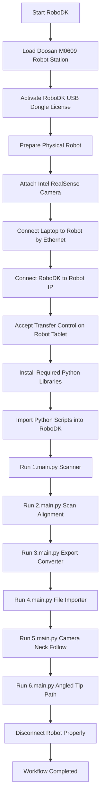

# 🤖 Robotic 3D Environment Mapping

This project creates a robotic 3D environment mapping workflow using **RoboDK**, a **Doosan Robotics M0609 robot**, and an **Intel RealSense camera**.
It is used to scan the inside of a cabinet, process point cloud data, align the scanned model, import/export files in RoboDK, and generate robot movement paths.

---

## 🎯 Objectives

* 🤖 Control the **Doosan Robotics M0609** robot through RoboDK
* 📷 Use an **Intel RealSense camera** for 3D scanning
* 🧱 Scan the inside of a cabinet or box environment
* 🗺️ Process and align 3D point cloud data
* 📦 Export scanned data into RoboDK-compatible formats
* 🔁 Import processed files back into RoboDK
* 🎥 Generate camera-follow robot movement
* 🛠️ Generate an angled tip path for final movement testing
* 🧪 Test the full workflow first in simulation before using the physical robot

---

## 🧩 System Design



---

## 📂 Folder Structure

```text
Robotic-3D-Environment-Mapping/
├── 1. Final Product/
│   ├── Python Code/
│   │   ├── 1. adaptive_inside_box_scanner/      # Robot scanning workflow
│   │   ├── 2. robodk_scan_alignment/            # Point cloud alignment
│   │   ├── 3. robodk_export_converter/          # RoboDK export conversion
│   │   ├── 4. robodk_file_importer_oop/         # Import converted files into RoboDK
│   │   ├── 5. camera_neck_follow/               # Camera-follow robot movement
│   │   └── 6. angled_tip_path/                  # Final angled tip path
│   │
│   └── Python Code.zip
│
├── CAD Model/                                   # Cabinet and SolidWorks models
│   ├── 4. Cabinet Correct Measurements.STL
│   ├── 5. Cabinet Correct Measurements.STL
│   ├── 6. Cabinet Correct Measurements.STL
│   ├── 7. Cabinet Correct Measurements.STL
│   ├── 8. Cabinet Correct Measurements.STL
│   ├── Box.SLDPRT
│   ├── Box 2.SLDPRT
│   └── Box 3.SLDPRT
│
├── RoboDK/                                      # RoboDK station files
│   ├── 4. Semi-Final Product.rdk
│   ├── 5. Final Product.rdk
│   ├── New Station (1).rdk
│   └── import_stl_to_robodk.py
│
└── RoboDK Export/                               # Exported RoboDK scan files
    ├── 02_scan_cleaned_inside_stl_range_ROBODK_MM.stl
    ├── 02_scan_cleaned_inside_stl_range_ROBODK_MM_COLORED.mtl
    ├── 02_scan_cleaned_inside_stl_range_ROBODK_MM_COLORED.obj
    ├── 04_aligned_cabinet_ROBODK.stl
    ├── 04_aligned_cabinet_ROBODK_MM.stl
    └── 05_cad_to_robot_base_transform.txt
```

---

## ⚙️ Required Tools

* **RoboDK 6.0** → Robot simulation and robot control
* **RoboDK USB dongle license** → Required to run RoboDK with the correct license
* **Doosan Robotics M0609** → Physical robot used in this project
* **Doosan robot tablet** → Used to start the robot and accept transfer control
* **Intel RealSense camera** → Used for 3D scan capturing
* **3D printed camera mount** → Used to attach the camera to the robot
* **Ethernet cable** → Used to connect the laptop to the physical robot
* **Ethernet-to-USB adapter** → Needed if the laptop has no Ethernet port
* **Python** → Used to run the project scripts
* **Git** → Used to clone the repository
* **Windows laptop or PC** → Main environment for running the workflow

---

## 🚀 Step-by-Step Setup

### ▶️ Step 1: Install RoboDK

Download and install **RoboDK version 6.0**:

```text
https://robodk.com/download
```

After installation, open RoboDK.

---

### ▶️ Step 2: Download the Doosan Robotics M0609 Station

In RoboDK:

```text
File → Open Sample Stations → Robots → Search: Doosan Robotics M0609
```

Download the robot station and move it into the RoboDK local sample library.

---

### ▶️ Step 3: Activate the RoboDK USB Dongle License

1. Plug the RoboDK USB dongle into the laptop.
2. Open RoboDK.
3. Go to:

```text
Help → License → USB Dongle
```

The RoboDK title bar should show that the licensed version is active.

---

### ▶️ Step 4: Switch On the Physical Robot

1. Go to the robot control box.
2. Use the switch under the control box to turn on the robot.
3. Wait until the control box starts.
4. Turn on the robot tablet using the power button at the upper-left side of the tablet.

---

### ▶️ Step 5: Attach the Intel RealSense Camera

1. Attach the 3D printed camera mount to the robot.
2. Place the Intel RealSense camera on the mount.
3. Screw the camera firmly onto the mount.
4. Connect the camera cable to the camera.
5. Connect the other end of the cable to the laptop or PC.
6. Make sure the cable is not blocking the robot movement path.

⚠️ Do not continue if the camera is loose or the cable is in the robot working area.

---

### ▶️ Step 6: Connect RoboDK to the Physical Robot

In RoboDK:

```text
Right-click Doosan Robotics M0609 → Connect to Robot
```

Enter the robot IP address:

```text
192.168.137.50
```

On the robot tablet:

```text
Settings → Network
Password: admin
```

After clicking **Connect** in RoboDK, accept **Transfer Control** on the robot tablet.

✅ The connection is successful when:

* The connection status is green
* The status says `Ready`
* The robot joints make a clicking sound

---

### ▶️ Step 7: Install Required Python Libraries

RoboDK uses its own embedded Python environment.
Install the required libraries inside RoboDK embedded Python.

Open Command Prompt and run:

```cmd
"C:\RoboDK\Python-Embedded\python.exe" -m pip install open3d
```

Then run:

```cmd
"C:\RoboDK\Python-Embedded\python.exe" -m pip install pyrealsense2
```

These libraries are required for point cloud processing and Intel RealSense camera support.

---

### ▶️ Step 8: Clone the Repository

```cmd
git clone https://github.com/DarylGenove/Robotic-3D-Environment-Mapping.git
```

```cmd
cd Robotic-3D-Environment-Mapping
```

If the final files are stored on the `develop` branch, run:

```cmd
git checkout develop
```

---

## 🧪 Running the Workflow

The main Python files are located in:

```text
Robotic-3D-Environment-Mapping\1. Final Product\Python Code
```

The scripts must be imported into RoboDK and executed one by one.

---

## ▶️ Correct Running Order

```text
1.main.py → 2.main.py → 3.main.py → 4.main.py → 5.main.py → 6.main.py
```

| Step | Program                     | Folder                           | Main File   |
| ---- | --------------------------- | -------------------------------- | ----------- |
| 1    | Adaptive Inside Box Scanner | `1. adaptive_inside_box_scanner` | `1.main.py` |
| 2    | RoboDK Scan Alignment       | `2. robodk_scan_alignment`       | `2.main.py` |
| 3    | RoboDK Export Converter     | `3. robodk_export_converter`     | `3.main.py` |
| 4    | RoboDK File Importer OOP    | `4. robodk_file_importer_oop`    | `4.main.py` |
| 5    | Camera Neck Follow          | `5. camera_neck_follow`          | `5.main.py` |
| 6    | Angled Tip Path             | `6. angled_tip_path`             | `6.main.py` |

⚠️ Wait until the current script is finished before running the next script.

---

## 🖥️ Recommended Run Method in RoboDK

The recommended method is:

```text
Right-click Python file → Edit Python Script → Run → Run Module
```

This method is better because it shows detailed runtime messages and possible errors.

---

## 🖱️ Alternative Run Method

You can also double-click the Python file inside RoboDK.

This starts the script directly, but it may show less detailed information compared to the script editor method.

---

## ✅ Expected Result

After running the full workflow correctly:

* ✅ RoboDK opens the Doosan Robotics M0609 station
* ✅ RoboDK connects to the physical robot
* ✅ Robot status becomes green and says `Ready`
* ✅ Intel RealSense camera is attached and detected
* ✅ Required Python libraries are installed
* ✅ Cabinet scan workflow starts
* ✅ Point cloud data is processed
* ✅ Scan data is aligned
* ✅ Exported files are created
* ✅ Converted files are imported back into RoboDK
* ✅ Camera-follow movement is generated
* ✅ Angled tip path is executed as the final movement

---

## ✅ Verification Checklist

* [ ] RoboDK version 6.0 is installed
* [ ] RoboDK USB dongle license is connected
* [ ] Doosan Robotics M0609 station is loaded
* [ ] Robot control box is switched on
* [ ] Robot tablet is switched on
* [ ] Intel RealSense camera is mounted firmly
* [ ] Camera cable is connected to the laptop or PC
* [ ] Ethernet cable is connected between laptop and robot
* [ ] Robot IP address is entered in RoboDK
* [ ] Transfer Control is accepted on the robot tablet
* [ ] RoboDK connection status is green and says `Ready`
* [ ] `open3d` is installed in RoboDK embedded Python
* [ ] `pyrealsense2` is installed in RoboDK embedded Python
* [ ] Six Python scripts are imported into RoboDK
* [ ] Scripts are executed in the correct order
* [ ] Robot is disconnected properly after testing

---

## 🛠️ Troubleshooting

| Problem                              | Possible Fix                                                                        |
| ------------------------------------ | ----------------------------------------------------------------------------------- |
| ❌ RoboDK is still in Free mode       | 🔧 Check the USB dongle and activate it through `Help → License → USB Dongle`       |
| ❌ Doosan robot station is missing    | 🔧 Download it from RoboDK sample stations and move it to the local RoboDK library  |
| ❌ Robot does not turn on             | 🔧 Check the switch under the robot control box and the tablet power button         |
| ❌ RoboDK cannot connect to the robot | 🔧 Check Ethernet cable, robot IP address, and Transfer Control permission          |
| ❌ Connection is not green            | 🔧 Check if the IP address is `192.168.137.50`                                      |
| ❌ Camera is not detected             | 🔧 Check the camera cable and make sure the camera is firmly screwed onto the mount |
| ❌ Python file does not start         | 🔧 Check whether the file was imported into RoboDK correctly                        |
| ❌ Missing `open3d`                   | 🔧 Run the `pip install open3d` command using RoboDK embedded Python                |
| ❌ Missing `pyrealsense2`             | 🔧 Run the `pip install pyrealsense2` command using RoboDK embedded Python          |
| ❌ Robot does not move                | 🔧 Check whether the RoboDK connection status is green and says `Ready`             |
| ❌ Robot moves incorrectly            | 🔧 Check robot reference frame, tool frame, camera frame, and model position        |
| ❌ Joint limit error                  | 🔧 Stop the program and check whether the generated path is reachable               |

---

## ⚠️ Safety Notes

Before running the workflow on the physical robot:

* Test all six programs in RoboDK simulation first
* Keep the robot speed low during the first real test
* Make sure the emergency stop is available
* Keep people away from the robot working area
* Make sure the camera is firmly attached
* Make sure the camera cable is not in the robot path
* Stop the program immediately if the robot moves unexpectedly
* Do not continue if RoboDK shows frame, movement, connection, or joint limit errors

---

## 🔌 Proper Robot Disconnection

After finishing the workflow, disconnect the robot correctly.

Correct order:

```text
Stop programs → Right-click robot → Connect to Robot → Disconnect → Check status → Unplug cable
```

Steps:

1. Stop all running Python programs in RoboDK.
2. Right-click the Doosan Robotics M0609 robot.
3. Click **Connect to Robot**.
4. Click **Disconnect**.
5. Check that the status is no longer green and no longer says `Ready`.
6. Unplug the Ethernet cable.
7. Remove the RoboDK USB dongle if needed.
8. Disconnect the camera cable after the robot and program are fully stopped.

⚠️ Do not unplug the Ethernet cable before disconnecting the robot inside RoboDK.

---

## 👤 Author

**Daryl Genove**
NHL Stenden University of Applied Sciences
